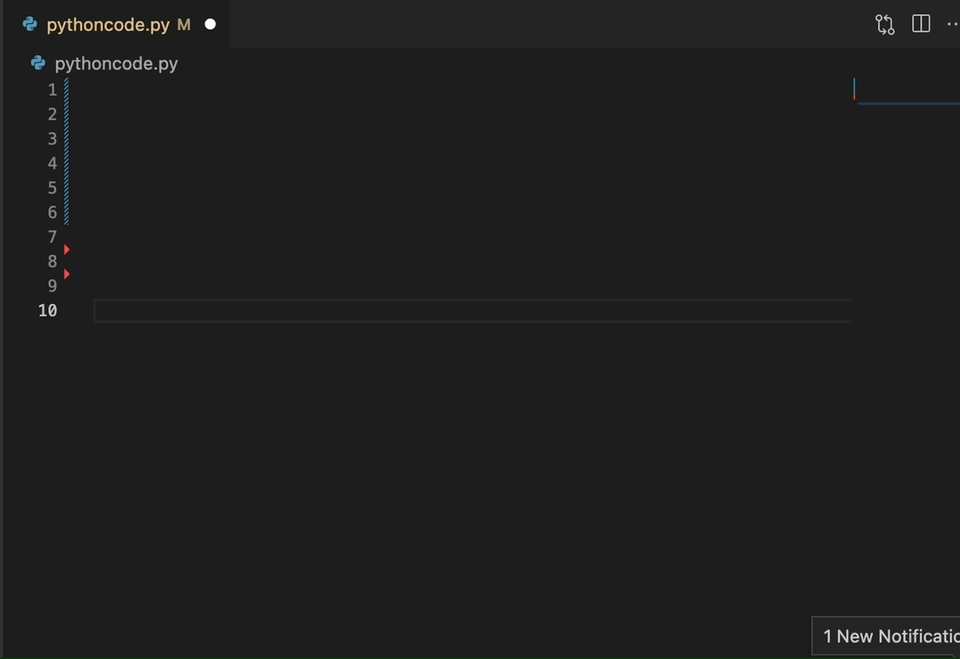

[](https://join.slack.com/t/codigahq/shared_invite/zt-9hvmfwie-9BUVFwZDwvpIGlkHv2mzYQ)
[](https://twitter.com/getcodiga)
[](https://marketplace.visualstudio.com/items?itemName=codiga.vscode-plugin)
[](https://marketplace.visualstudio.com/items?itemName=codiga.vscode-plugin)
[](https://app.codiga.io/public/project/29693/vscode-plugin/dashboard)
[](https://app.codiga.io/public/project/29693/vscode-plugin/dashboard)

[Codiga](https://www.codiga.io) is a [Smart Code Snippets](https://www.codiga.io/code-snippets/smart-code-snippets/) manager. Create, share, search and use Smart Code Snippets from your IDE.

# Codiga: Static Code Analysis & Code Snippets on Steroids

- [**Static Code Analysis**](#static-code-analysis): select the rules from the [Codiga Hub](https://app.codiga.io/hub/rulesets) and get real-time analysis in your IDE
- [**Code Snippets**](#code-snippets): use snippets from the [Codiga Hub](https://app.codiga.io/hub) or create/share private code snippets with your team.

## Static Code Analysis

The static code analysis works for Python in Beta.

With Codiga, you can:

- Use Code Analysis rules from the [Codiga Hub](https://app.codiga.io/hub/rulesets)
- Create your own Code Analysis rules


### Getting Started

Visit the [Codiga Hub](https://app.codiga.io/hub/rulesets) and select the rulesets to use for your project.

Then, create a `codiga.yml` at the root of your project with the list of rulesets you want to use.

### Configuration example

Example of `codiga.yml` for Python:

```yaml
rulesets:
  - python-security
  - python-best-practices
```

## Code Snippets

Look for snippets using a shortcut or search using inline completions like GitHub Copilot.

Adapt the list of snippets by adding your own.

### Quick Start

Start a comment and type what you want to have. Like GitHub Copilot, it suggests a list of snippets you can insert in your code.



### Use Snippets using Shortcuts

Install the extension and type `.` or `/` in your IDE to list all available smart code snippets for your project. Accept a smart code snippet using either Enter ↩ or Tab ↹. Go through the snippet variables using the Tab key.


**Note**: snippets are suggested based on your environment: language, libraries used, and filename (e.g. especially for YML files).

### Find and Reuse Smart Code Snippets

- Get all snippets with a shortcut by using `CTRL` + `ALT` + `S` (`CMD` + `SHIFT` + `S` - `⌘⇧S` on Mac) and reuse them inline
- Find snippets using an internal search engine using `CTRL` + `ALT` + `C` (`CMD` + `SHIFT` + `C` - `⌘⇧C` on Mac) and search for a snippet
- Import a snippet by typing its shortcut (e.g. `react.component` in JavaScript/Typescript or `requests.` in Python)


### Create Smart Code Snippets

Create a smart code snippet by selecting the code and click on `Create Codiga Snippet`. The keywords put in your snippet are used to index the snippet and find it using smart search.


### Supported Languages

C, C++, CSS, HTML, Java, Javascript, Typescript, Python, Dart, Ruby, PHP, Scala, Apex, Terraform, Docker, Go, Rust, Shell, Solidity, YAML.

## Getting API keys from Codiga

You need an API Token from [Codiga](https://codiga.io).
Log on [Codiga](https://app.codiga.io) using your GitHub, GitLab or Bitbucket account.

Then, in your preferences, generate a new API key as shown below.


Add the token in your VS Code preferences.


## Sending feedback

You can either fill a [bug report](https://github.com/codiga/vscode-plugin/issues) directly.
If you do not want to open a ticket, you can also directly [contact us](https://codiga.io/contact).

## Learn More

- [Official Documentation](https://doc.codiga.io/docs/coding-assistant/coding-assistant-vscode/)
- [List of all supported languages](https://doc.codiga.io/docs/faq/#what-languages-are-supported)
- [Privacy Policy](https://www.codiga.io/privacy)
