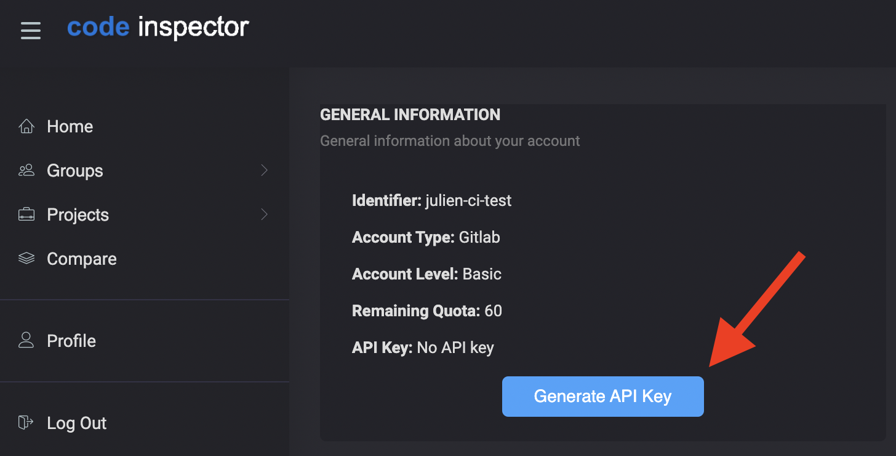

# Code Inspector Plugin

Integrates Code Inspector analysis engine into VS Code.
This plugin analyzes code for 12+ languages without installing any additional tools.

## Supported Languages

C, C++, Java, Javascript, Typescript, Python, Dart, Ruby, PHP, Scala, Apex

## Setup

### Getting API keys from Code Inspector

You need to get API keys from [Code Inspector](https://code-inspector.com).
Log on [Code Inspector](https://frontend.code-inspector.com) using your GitHub, GitLab or Bitbucket account.

Then, in your preferences, generate a new API key as shown below.

Your access and secret keys are then generated: all you need is to add them to your VS Code Plugin configuration.

### Add keys in the VS Code extension

Enter your API keys in your VS Code extension, as shown below.

## Sending feedback

You can either fill a [bug report](https://github.com/codeinspectorio/vscode-plugin/issues) directly.
If you do not want to open a ticket, you can also directly [contact us](https://code-inspector.com/contact). 

## Release Notes

### Version 0.0.1

 - Initial release

## Learn More
 * [Official Documentation](https://docs.code-inspector.com)
 * [Privacy Policy](https://code-inspector.com/privacy)